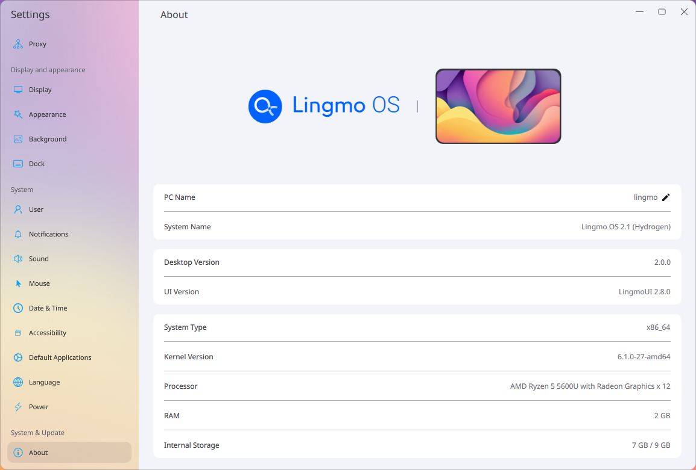

# lingmo-settings

TODO: Complete the LingmoUI page

> The system settings application for LingmoOS uses [LingmoUI](lingmoui) as the interface style. --Description of lingmo-settings GitHub repository
>
## Gallery (WIP)

*About Page on Lingmo OS 2.1*

*About Page on Lingmo OS 3.0 (Helium) rc*
